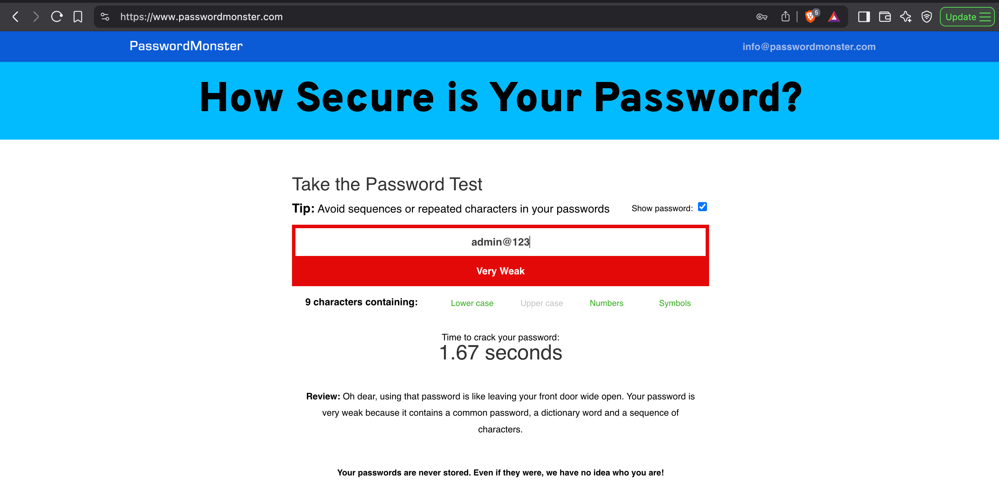
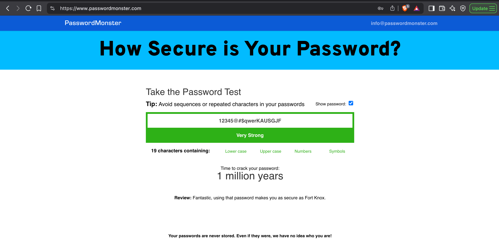
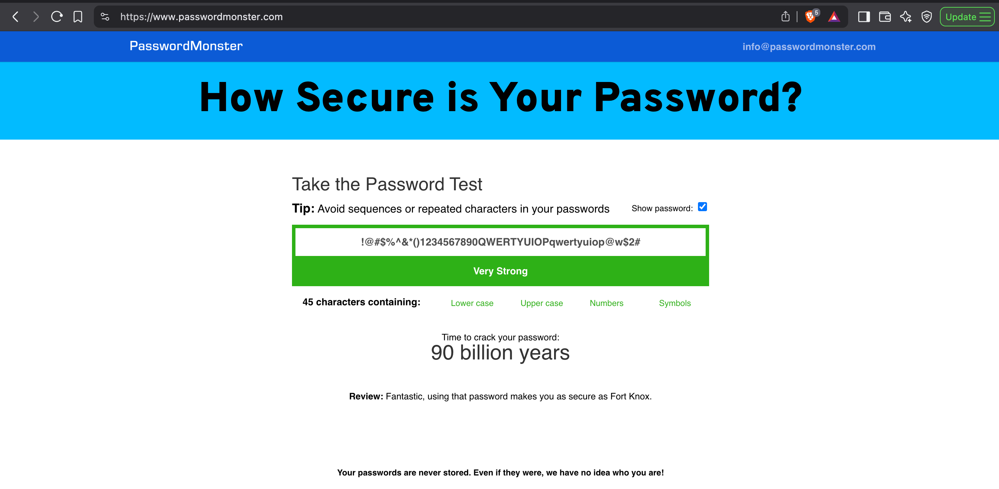

# Create-a-strong-password-and-evaluate-its-strength

## 🧠 Objective

Understand what makes a password strong by analyzing password complexity and evaluating them using a password strength checker.

---

## 🛠️ Tasks

1. Create multiple passwords with varying levels of complexity.
2. Use combinations of uppercase, lowercase, numbers, symbols, and different lengths.
3. Test each password using [PasswordMonster.com](https://www.passwordmonster.com/).
4. Record feedback and security scores for each password.
5. Identify best practices for strong password creation.
6. Summarize tips based on evaluations.
7. Research common password attack methods.
8. Analyze how password complexity influences security.

---

## 🔎 Password Testing Results

### ❌ Weak Passwords

| Password     | Feedback | Screenshot |
|--------------|----------|------------|
| `admin@123`  | Very weak – common word, sequence, and dictionary word. |  |
| `p@ssw0rd`   | Very weak – commonly used password. |  |
| `Lily1234`   | Very weak – contains a name and simple sequence. |  |
| `Harley0987` | Very weak – name and keyboard pattern. |  |

### ✅ Strong Passwords

| Password                          | Feedback | Screenshot |
|----------------------------------|----------|------------|
| `12345@#$qwerKAUSGJF`            | Very strong – “as secure as Fort Knox.” |  |
| `!@#$%^&*()1234567890QWERTYUIOPqwertyuiop@w$2#` | Extremely strong – “as secure as Fort Knox.” |  |

---

## 🧠 Key Learnings

### 💡 Tips for Creating Strong Passwords

- Use a combination of **uppercase**, **lowercase**, **numbers**, and **symbols**.
- Avoid **dictionary words**, **names**, or **common patterns**.
- Create passwords with a **length of 16+ characters**.
- Do not reuse passwords across multiple sites.
- Avoid **keyboard patterns** (e.g., `123456`, `qwerty`).

---

## ⚔️ Common Password Cracking Methods

### 1. **Brute Force Attack**
Tries all possible combinations until the correct password is found. Time-consuming but effective without rate limits.

### 2. **Dictionary Attack**
Uses a list of common words and phrases to guess passwords. Faster than brute force but less exhaustive.

### 3. **Rainbow Table Attack**
Matches precomputed password hashes against stolen hash data. Defeated by hashing with unique **salts**.

### 4. **Credential Stuffing**
Attempts previously leaked username-password combinations on new websites. Exploits password reuse.

### 5. **Phishing**
Tricks users into entering credentials on fake websites or forms. Doesn’t rely on guessing or cracking — just deception.

### 6. **Keylogging**
Records keystrokes using malware to capture passwords directly as they’re typed.

### 7. **Shoulder Surfing**
Visually observing someone typing a password, especially in public places.

### 8. **Guessing / Social Engineering**
Exploits personal details like names, birthdays, or favorite things to guess passwords.

### 9. **Hybrid Attack**
Combines dictionary and brute-force techniques — e.g., tries “password123” or “admin@2024”.

### 10. **Man-in-the-Middle (MitM) Attack**
Intercepts network traffic to steal login credentials during transmission, especially on unsecured networks.

---

## 🔐 How Complexity Helps

Strong passwords — long, unique, and random — dramatically reduce the success rate of all the above methods. Complexity:
- Increases brute force difficulty exponentially.
- Defeats dictionary-based guessing.
- Avoids easy-to-guess personal or reused data.
- Resists automated attacks that rely on patterns or repetition.

---

## 🧪 Tool Used

- [PasswordMonster.com](https://www.passwordmonster.com/)

---

## 🖼️ Screenshots

All password strength evaluation screenshots are stored in the `/screenshots` folder.

---

## 📜 License

This project is licensed under the [MIT License](LICENSE).
